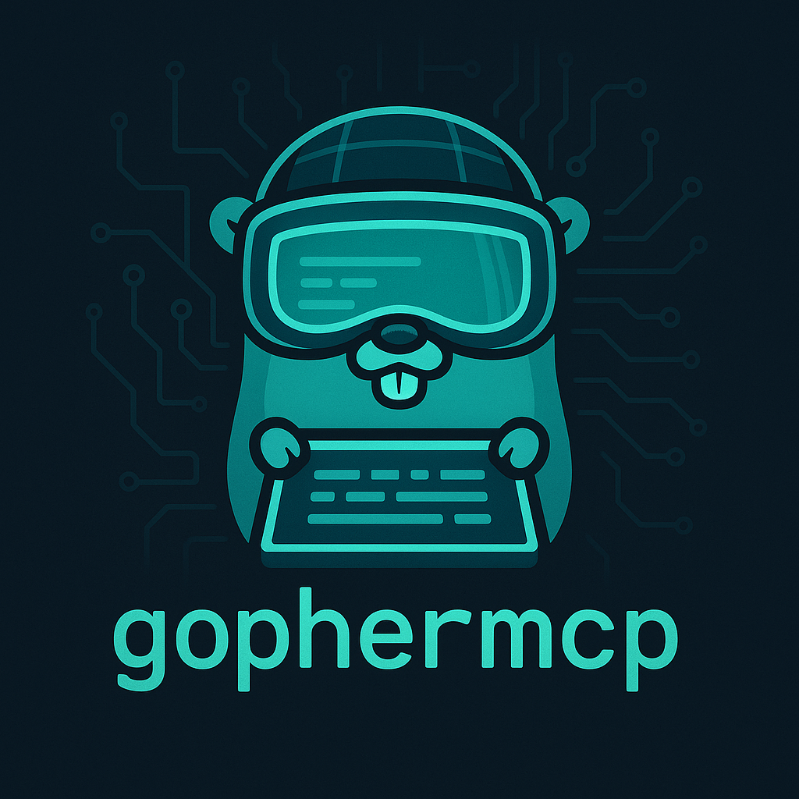

# gophermcp

[](https://goreportcard.com/report/github.com/njern/gophermcp)
[](https://godoc.org/github.com/njern/gophermcp)
[](LICENSE)



## Overview

`gopherMCP` is an MCP (Model Context Protocol) server that provides a client access to Go documentation for any package. If you are using an LLM to edit code, this can help the LLM look up documentation and not need to rely on outdated docs it may have in its own training data.

## Installation

```bash
go install github.com/njern/gophermcp
```

### Using the server with Cursor

- Create an `mcp.json` file in the `.cursor` directory in your project root folder unless one already exists.
- Add `gophermcp` like this:

```
{
  "mcpServers": {
    "gophermcp": {
      "command": "/path/to/go/binaries/gophermcp",
      "args": []
    }
  }
}
```

## License

This project is licensed under the MIT License - see the [LICENSE](LICENSE) file for details.

## Future plans

Expand into other tools which may be useful for an LLM creating Go code.

## Acknowledgements

This project was inspired by [godoc-mcp](https://github.com/mrjoshuak/godoc-mcp), which forms the basis for the `godoc` package. 